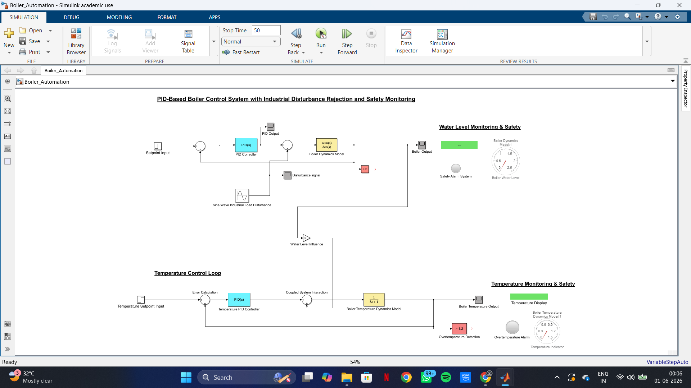
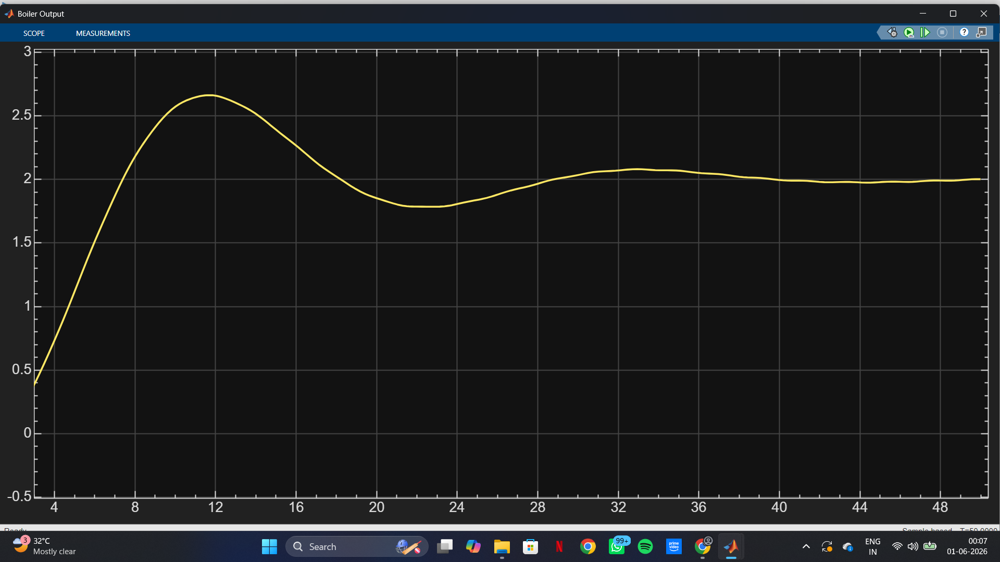
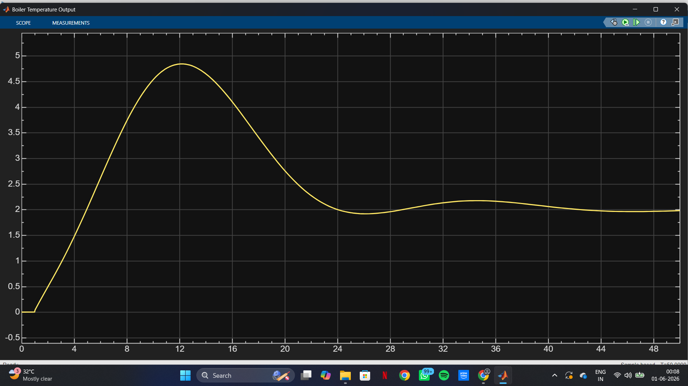
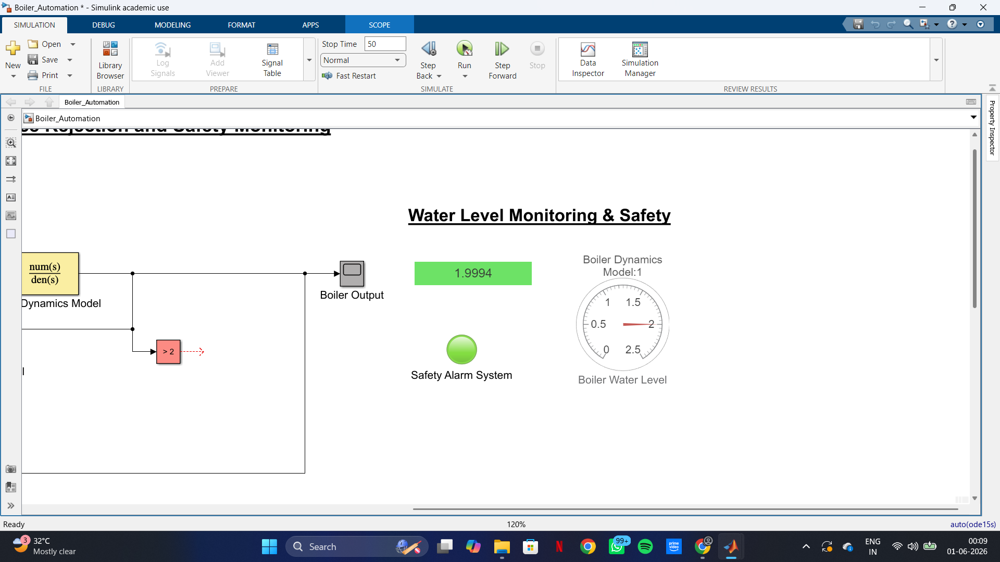

# Boiler-automation-simulink
Industrial boiler automation simulation using MATLAB/Simulink
# Multi-Variable Boiler Automation using MATLAB/Simulink

## Overview

This project simulates an industrial boiler automation system using MATLAB/Simulink.

The system controls:

- Boiler Water Level
- Boiler Temperature

using PID-based closed-loop control.

---

## Features

- PID Control
- Water Level Control Loop
- Temperature Control Loop
- Coupled Multi-Variable Control
- Disturbance Rejection
- Safety Alarm System
- Real-Time Monitoring Dashboard

---

## System Architecture

Water Level Loop:

Setpoint → PID → Boiler Dynamics → Output → Feedback

Temperature Loop:

Setpoint → PID → Boiler Temperature Dynamics → Output → Feedback

Coupling:

Water Level Output → Gain Block → Temperature Loop

---

## Transfer Functions

Water Level Dynamics:

G(s) = 1/(10s² + 7s + 1)

Temperature Dynamics:

G(s) = 1/(8s + 1)

---

## Software Used

- MATLAB
- Simulink

---

## Files

- Boiler_Automation.slx
- Boiler_Automation_Report.pdf

---

## Author

Prajwal Kale

B.Tech Instrumentation & Control Engineering

VIT Pune

## Screenshots

### Complete Simulink Model

### Water Level Response

### Temperature Response

### Monitoring Dashboard

